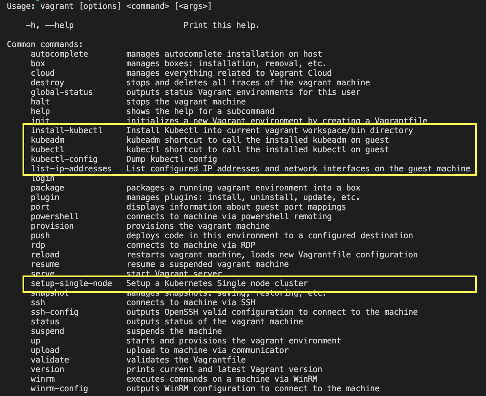

# Begin

Welcome to this modest project, a box to easily create Kubernetes clusters using Vagrant by Hashicorp

Just run ***vagrant up*** command and get a worked box with all installed tools, modules and settings to create a Kubernetes cluster

Debian GNU/Linux is used as OS based system for compatibily reasons among the listed [hypervisors](#hypervisor) below
___
***Note:***
Vagrant Cloud repository: [https://app.vagrantup.com/Yohnah/boxes/Kubernetes](https://app.vagrantup.com/Yohnah/boxes/Kubernetes)

Vagrant Cloud repository support the following providers: VirtualBox. If you need to get a version for other of compatible [hypervisors](#hypervisor), please see the "[Building from sources](#building-from-sources)" section for more information
___

- [Begin](#begin)
- [Requirements](#requirements)
  - [Compatible Operative Systems as host](#compatible-operative-systems-as-host)
  - [Software](#software)
  - [Hypervisors](#hypervisors)
  - [In order to build yourself](#in-order-to-build-yourself)
- [Issues](#issues)
- [How to use](#how-to-use)
  - [Short prompts](#short-prompts)
  - [Long prompts](#long-prompts)
    - [Vagrant commands](#vagrant-commands)
  - [Usage examples](#usage-examples)
    - [Setup a single node kubernetes cluster](#setup-a-single-node-kubernetes-cluster)
    - [Setup a full kubernetes cluster](#setup-a-full-kubernetes-cluster)
    - [Connect to Kubernetes cluster using kubectl](#connect-to-kubernetes-cluster-using-kubectl)
- [Keep in mind](#keep-in-mind)
  - [Running on MacOS](#running-on-macos)
  - [Running on VirtualBox](#running-on-virtualbox)
  - [Running on VMWare_Desktop](#running-on-vmware_desktop)
- [Building from sources](#building-from-sources)
  - [Running the GNU make command](#running-the-gnu-make-command)
  - [Just Packer](#just-packer)
  - [Test and use it](#test-and-use-it)

# Requirements

## Compatible Operative Systems as host

* Windows 10/11
* MacOS (only tested on x86_64)
* GNU/Linux

## Software

* Vagrant: <https://www.vagrantup.com/>

## Hypervisors

One of the following hypervisors must be installed:

* Virtualbox: <https://www.virtualbox.org/>

## In order to build yourself

* GNU Make: <https://www.gnu.org/software/make/>
* Packer: <https://www.packer.io/>
* jq: <https://stedolan.github.io/jq/>
* Window Subsystem LInux or CygWin if Windows is used (to run the "make" command)

# Issues

If you get an issue or problem running Yohnah/Kubernetes, please, kindly open a new issue ticket or review the current issue tickets into [issues section](https://github.com/Yohnah-org/Kubernetes/issues) into GitHub portal. Please, be as detailed as possible 

# How to use

## Short prompts

Run on Unix-Like and MacOs:

~~~
$ vagrant init Yohnah/Kubernetes #or vagrant init --box-version '<kubernetes version>' Yohnah/Kubernetes
$ vagrant up #or vagrant up --provider <hypervisor>
~~~

On Windows PowerShell:

~~~
PS C:\Users\JohnDoe> vagrant.exe init Yohnah/Kubernetes #or vagrant.exe init --box-version '<kubernetes version>' Yohnah/Kubernetes
PS C:\Users\JohnDoe> vagrant.exe up #or vagrant up --provider <hypervisor>
~~~

On Windows CMD:

~~~
C:\Users\JohnDoe> vagrant.exe init Yohnah/Kubernetes #or vagrant.exe init --box-version '<kubernetes version>' Yohnah/Kubernetes
C:\Users\JohnDoe> vagrant.exe up #or vagrant up --provider <hypervisor>
~~~

Where "\<kubernetes version\>" is the specific version of Kubernetes you want to use according Kubernetes releases notes <https://kubernetes.io/releases/>

___
***Note:***
See Kubernetes docs for futher information about:

* Kubeadm (https://kubernetes.io/docs/reference/setup-tools/kubeadm/) 
* Kubectl (https://kubernetes.io/docs/reference/kubectl/)
___

Just run the kubeadm init to create and Kubectl as follows:

~~~
$ vagrant kubeadm -- <attributes> # it is the same as "kubeadm <attributes>" regarding the standard kubeadm command
~~~

Ex:

~~~
$ vagrant kubeadm -- init # like "kubeadm init" standard command
~~~

Or just run the setup-single-node to get a Kubernetes cluster working on single node, such as:

~~~
$ vagrant setup-single-node
~~~

And manage the cluster using the vagrant command

~~~
$ vagrant kubectl -- <attributes> # such as "kubectl <attributes>" standard command
~~~

Ex:

~~~
$ vagrant kubectl -- get nodes # such as "kubectl get nodes" standard command
~~~

If you prefer use a kubectl client binary from another host (or from vagrant host) you can dump the kubectl configuration with the following command:

~~~
$ vagrant kubectl-config > /path/to/dump/kubectl/config
~~~

Ex:

~~~
$ vagrant kubectl-config > $HOME/.kube/config
~~~

Also, if you need, you can install the kubectl client binary, performing the command:

~~~
$ vagrant install-kubectl
~~~

And finding the client into "/vagrant workspace/bin" directory, and used it as follows:

~~~
$ export KUBECONFIG=/path/where/dumped/kubectl/config
$ /<vagrant workspace>/bin/kubectl get nodes
~~~

___
***Note:***
Also, you can add the "/vagrant workspace/bin" directory to $PATH environment variable in your syste host
___

***Note:***
An Alias can be created to use the vagrant commands, such as:
~~~
$ alias kubectl="vagrant kubectl --"
$ alias kubeadm="vagrant kubeadm --"
~~~
___

Finally, to list the IP addresses configured onto box, run:

~~~
$ vagrant show-ips
~~~

For several examples see the section #TODO

## Long prompts
___
***Note:*** The Unix and Unix-like commands shown below are the same for Windows OS, but knowing the commands ends with a .exe suffix (ex: kubectl.exe or vagrant.exe)
___

The Yohnah/Kubernetes vagrant box was developed to be a easy solution to create Kubernetes clusters at home.

Once the requirements are installed, in order to get Yohnah/Kubernetes running on your system or device, the following command must be run within a directory on your host:

~~~
$ vagrant init Yohnah/Kubernete
~~~

This command set a vagrant workspace in the directory where it was run.

Next step the following command:

~~~
$ vagrant up
~~~

or alternative:

~~~
$ vagrant up --provider <hypervisor>
~~~

Which \<hypervisor\> should be one of supported ones listed in requirements section. 

The last command will perform the following steps:

1. Detect if the box was already downloaded, else, will download it from [Vagrant Cloud](https://app.vagrantup.com/Yohnah/boxes/kubernetes)
2. Raise the virtual machine up, using the default hypervisor configured on host, or using the hypervisor set by the --provider tag
3. Add code into the current Vagrantfile file to activate Vagrant commands for vagrant client. See the next picture:

___
***Note:***
The port 127.0.0.1:6443/TCP will bind in your vagrant to forward it to 127.0.0.1:6443/TCP on guest.

If many Yohnah/Kubernetes boxes are up, the binded port in your host could be different, run "vagrant port" command to get the current working port in your vagrant workspace
___
***Note:***
For further information about how Vagrant works, please visit https://www.vagrantup.com/docs
___

### Vagrant commands

Once vagrant up was successfuly executed, the local Vagrantfile got added new code to add new features for vagrant cli.

The new commands are:

- **setup-single-node**. This command will raise a new Kubernetes cluster working in a single node. A Kubernetes control plane with the capacity to run Pods (the control-plane is tainted to do it). No arguments need.

~~~
$ vagrant setup-single-node
~~~

- **kubeadm**. SSH wrapper to pass all kubeadm arguments to installed kubeadm client on guest. It works as:

~~~
$ vagrant kubeadm -- <arguments>
$ vagrant kubeadm -- init
~~~

- **kubectl**. SSH wrapper to pass all kubeadm arguments to installed kubectl client on guest. It works as:

~~~
$ vagrant kubectl -- <arguments>
$ vagrant kubectl -- get nodes
~~~

- **kubectl-config**. Dump the kubectl config file to connect to kubernetes cluster once the kubernetes cluster control-plane was init. No arguments need

~~~
$ vagrant kubectl-config > $HOME/.kube/config
~~~

- **install-kubectl**. Install the last kubectl binary client into /bin directory created within the current vagrant workspace. The kubectl client installed will be according the host Operative System and CPU architecture. No arguments need.

~~~
$ vagrant install-kubectl
~~~

- **show-ips**. To list the current configured IP addresses.

~~~
$ vagrant show-ips
~~~

___
***Note***
Vagrant kubeadm and vagrant kubectl commands works like vagrant ssh, they require two hypens to pass arguments to guest.

Ex:
~~~
$ vagrant kubectl -- get nodes
~~~

equal to:

~~~
$ vagrant ssh -- kubectl get nodes
~~~
___
***Note***

Shell aliases can be set.

~~~
$ alias kubectl="vagrant kubectl --"
$ alias kubeadm="vagrant kubeadm --"
~~~

And then:

~~~
$ kubectl get pods
$ kubeadm init
~~~
___

## Usage examples

Here show some basic examples of how to create a kubernetes cluster. See the oficial Vagrant and Kubernetes documentations for other considerations.

### Setup a single node kubernetes cluster

1. Create the vagrant workspace and up the Yohnah/Kubernetes box

~~~
$ mkdir kubernetes-control-plane
$ cd ./kubernetes-control-plane
$ vagrant init Yohnah/Kubernetes
$ vagrant up
~~~

2. Execute the setup-single-node command

~~~
$ vagrant setup-single-node
~~~

### Setup a full kubernetes cluster

1. Create the vagrant workspaces for control-plane and workers

Control-plane
~~~
$ mkdir kubernetes-control-plane
$ cd ./kubernetes-control-plane
$ vagrant init Yohnah/Kubernetes
~~~

And worker
~~~
$ mkdir kubernetes-worker
$ cd ./kubernetes-worker
$ vagrant init Yohnah/Kubernetes
~~~

2. Edit Vagrantfile files of control-plane and workers to add network configuration

Although, it can be done as you prefer, a good practices would be create a transit network to communicate all workers with control-plane. In this example, we are going to setup and private network for transit and public network for bridging (see [Vagrant network](https://www.vagrantup.com/docs/networking) documentation for further information)

* In control-plane and workes add into Vagrantfile:

~~~
Vagrant.configure("2") do |config|
  [...]
  config.vm.network "private_network", type: "dhcp" # for transit network
  config.vm.network "public_network", type: "dhcp", bridge: "<set the default host nic to use>" #for public bridging
  [...]
end
~~~

And also set the hostnames:

* In Control-plane Vagrantfile file:

~~~
Vagrant.configure("2") do |config|
  [...]
  config.vm.hostname = "controlplane" # the name can be whatever you want, but it must be unique in the network
  [...]
end
~~~

* In Worker Vagrnatfile file:

~~~
Vagrant.configure("2") do |config|
  [...]
  config.vm.hostname = worker1" # or worker2, worker3 depends on numer of workers you need. The name can be whatever you want but it must be unique in the network
  [...]
end
~~~

___
***Note***
Yohnah/Kubernetes box run avahi-daemon to DNS Zeroconf LAN resolver. So, running boxes can connect among them just using their configured hostname, like:

~~~
controlplane$ ping worker1.local

worker1$ ping controlplane.local
~~~
___

3. Up the boxes and setup the cluster

* Control-plane
~~~
$ vagrant up
$ vagrant kubeadm -- init --apiserver-advertise-address <IP address of control-plane for transit network> --apiserver-cert-extra-sans 127.0.0.1 #extra Cert SANS to allow localhost to connect to kubernetes cluster
$ kubectl apply -f https://projectcalico.docs.tigera.io/manifests/calico.yaml #Another CNI can be installed, such as flannel, weave, consul, etc
~~~

Copy the resulted hashes of tokens once the kubeadm init ends.

* Workers
~~~
$ vagrant up
$ vagrant kubeadm -- join <IP address of control-plane in transit network> --token <token hash>  #paste the propers tokens
~~~

### Connect to Kubernetes cluster using kubectl

1. Using the vagrant kubectl command

From controlpanel vagrant workspace, just run:

~~~
$ vagrant kubectl -- --help
$ vagrant kubectl -- get nodes
$ vagrant kubectl -- run nginx --image=nginx --restart=Never
$ vagrant kubectl -- exec --stdin --tty nginx -- /bin/bash
~~~

Or with a shell alias

~~~
$ alias kubectl="vagrant kubectl --"
$ kubectl --help
$ kubectl get nodes
$ kubectl run nginx --image=nginx --restart=Never
$ kubecdtl exec --stdin --tty nginx -- /bin/bash
~~~

2. Using an external kubectl client

* Dump the kubectl config to file
~~~
$ vagrant kubectl kubectl-config > /tmp/kube-config
$ export KUBECONFIG=/tmp/kube-config
~~~

* Install a kubectl client

~~~
$ vagrant install-kubectl
$ cd ./bin #the bin directory is created into the current vagrant workspace
~~~
___
***Note***
Also, it is possible install kubectl regarding kubernetes documentation https://kubernetes.io/docs/tasks/tools/
___
***Note***
You can add the bin directory to environment $PATH variable
___

* Use kubectl
~~~
$ kubectl --help
$ kubectl get nodes
$ kubectl run nginx --image=nginx --restart=Never
$ kubecdtl exec --stdin --tty nginx -- /bin/bash
~~~

___
***Note***
Also it can set the kubeconfig file using --kubeconfig flag for kubectl

Ex:

~~~
$ kubectl get nodes --kubeconfig /tmp/kube-config
$ kubectl run nginx --image=nginx --restart=Never --kubeconfig /tmp/kube-config
$ kubecdtl exec --stdin --tty nginx -- /bin/bash --kubeconfig /tmp/kube-config
~~~
___

Or using [kubectl context](https://kubernetes.io/docs/tasks/access-application-cluster/configure-access-multiple-clusters/)

# Keep in mind

## Running on MacOS

The Yohnah/Kubernetes box was built and test on MacOS Big Sur compatible with Vagrant. In spite of it, it should run on any x86/amd64 MacOS and not on new chips M1 Apple Silicon.

The main reason about it, I had no the opportunity to get a M1/M2 Apple Silicon to build the packer instructions for M1/M2 chip. So, when I may get one, I'll alter the packer code to support M1. It requires to using an GNU/Linux SO with ARM arch support.

Probably, the adaptation to M1/M2 chip, will be performed on Parallels as hypervisor and not on VirtualBox. VirtualBox has no support for M1/M2 chip yet at the time of writting this.

## Running on VirtualBox

VirtualBox is supported for most kind of operative systems in the market. Virtuanbox run on Windows, MacOs and GNU/Linux (always x86_64), hence, you can use Yohnah/Kubernetes on any Host OS supported by Virtualbox

## Running on VMWare_Desktop

VMWare fusion was used to create and test the vagrant box, hence, if you detect any trouble using it on WMWare workstation or others, please, kindly report it into [issues section](https://github.com/Yohnah-org/kubernetes/issues)

There are several known issues when Vagrant is running using vmware_desktop provider. Please, visit <https://www.vagrantup.com/docs/providers/vmware/known-issues> for futher information.

# Building from sources

Another option to use Yohnah/Kubernetes is building it from sources.

To reach it out, first of all, the code must be cloned from the git repository on GitHub:

~~~
$ git clone github.com/Yohnah-org/Kubernetes.git
~~~

And, inside of git workspace run the following command:

## Running the GNU make command

~~~
$ make build
~~~

And a local box for virtualbox provider will build.

If you want to build a box for another [Hypervisor](#hypervisor) compatible, just run the make command as follows:

~~~
kubernetes/$ make build PROVIDER=<hypervisor>
~~~

Ex:
~~~
$ make PROVIDER=virtualbox #default behaviour
$ make PROVIDER=virtualbox
$ make PROVIDER=parallels
~~~

Once make was done, the box can be found at /tmp/packer-build directory

## Just Packer

On the other hand, you want to build the box just using Packer, then you have to fit the following variables in:

* output_directory to set the path where packer dump the box
* kubernetes_version to set what version of kubernetes must be installed
* debian_version to set the version of debian to build the virtual machine golden image for the esulting box

Also, you must use the -only param to set what provider want to use:

* builder.virtualbox-iso.kubernetes
* builder.parallels-iso.kubernetes
* builder.vmware-iso.kubernetes
* builder.hyperv-iso.kubernetes

As follows:

~~~
kubernetes/$ packer build -var "output_directory=</path/to/dump/the/box>" -var "debian_version=<version of debian>" -var "kubernetes_version=<version of kubernetes>" -only <builder to build the box> packer.pkr.hcl
~~~

Ex:
~~~
kubernetes/$ packer build -var "output_directory=/tmp" -var "debian_version=11.2.0" -var "kubernetes_version=20.10.13" -only builder.virtualbox-iso.kubernetes packer.pkr.hcl
~~~

For getting a built virtualbox box 

## Test and use it

Once the package box is created, just import it into vagrant doing:

~~~
$ vagrant box add --name "Yohnah/kubernetes" /path/to/package.box
~~~

Or

~~~
$ make add_box
~~~

/path/to/package.box is the path where the resulting box can be found

Finally, confirm the package was imported on Vagrant:

~~~
$ vagrant box list
~~~

Thereafter, follow the steps in the [how to use](#how-to-use) section